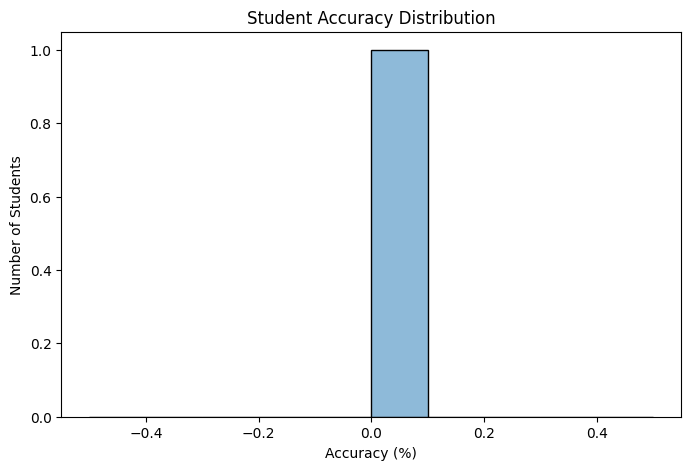
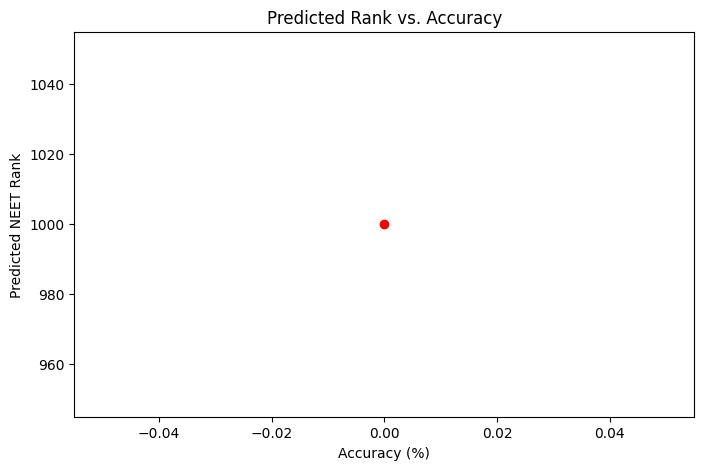

# Personalized Student Recommendations

## Project Overview
This project analyzes quiz performance to provide **personalized recommendations** for students preparing for the NEET exam. It evaluates student accuracy, highlights weak topics, and predicts NEET ranks based on performance trends.

## Features
- Fetches **current and historical quiz data** from APIs.
- Analyzes **student accuracy and weak topics**.
- Provides **personalized recommendations** for improvement.
- Uses **machine learning** to predict the **student's NEET rank**.
- Generates **visualizations** for insights into performance.

## Setup Instructions
### 1. Clone the Repository
```sh
git clone <repository_url>
cd <repository_name>
```
### 2. Install Dependencies
```sh
pip install -r requirements.txt
```
### 3. Run the Script
```sh
python main.py
```

## Approach Description
1. **Data Collection**
   - Fetches quiz data from API endpoints.
   - Parses and structures data for analysis.

2. **Performance Analysis**
   - Computes accuracy based on past quizzes.
   - Identifies weak topics per student.

3. **Recommendation Engine**
   - If accuracy < 50%, suggests weak topics for improvement.
   - Otherwise, provides encouragement and practice tips.

4. **NEET Rank Prediction**
   - Uses **Linear Regression** to predict ranks based on accuracy.

5. **Visualizations**
   - **Accuracy Distribution** (Histogram)
   - **Most Common Weak Topics** (Bar Chart)
   - **Predicted Rank vs. Accuracy** (Scatter Plot)

## Output Examples
- **Personalized Recommendations**
```json
{
  "YcDFSO4ZukTJnnFMgRNVwZTE4j42": {
    "message": "Improve accuracy! Focus on these topics:",
    "topics": [
      "General Practice"
    ]
  }
}
```
- **Predicted NEET Rank**
```json
{
  "YcDFSO4ZukTJnnFMgRNVwZTE4j42": 1000
}
```

## Screenshots



## Demo Video
📹 **[Link to Demo Video](video3805383979.mp4)** (2-5 min explaining script & outputs)

## Future Enhancements
- Improve **NEET rank prediction model** with more features.
- Implement **Flask API** to provide recommendations as a service.

---
Developed with ❤️ for **NEET students!** 🚀

